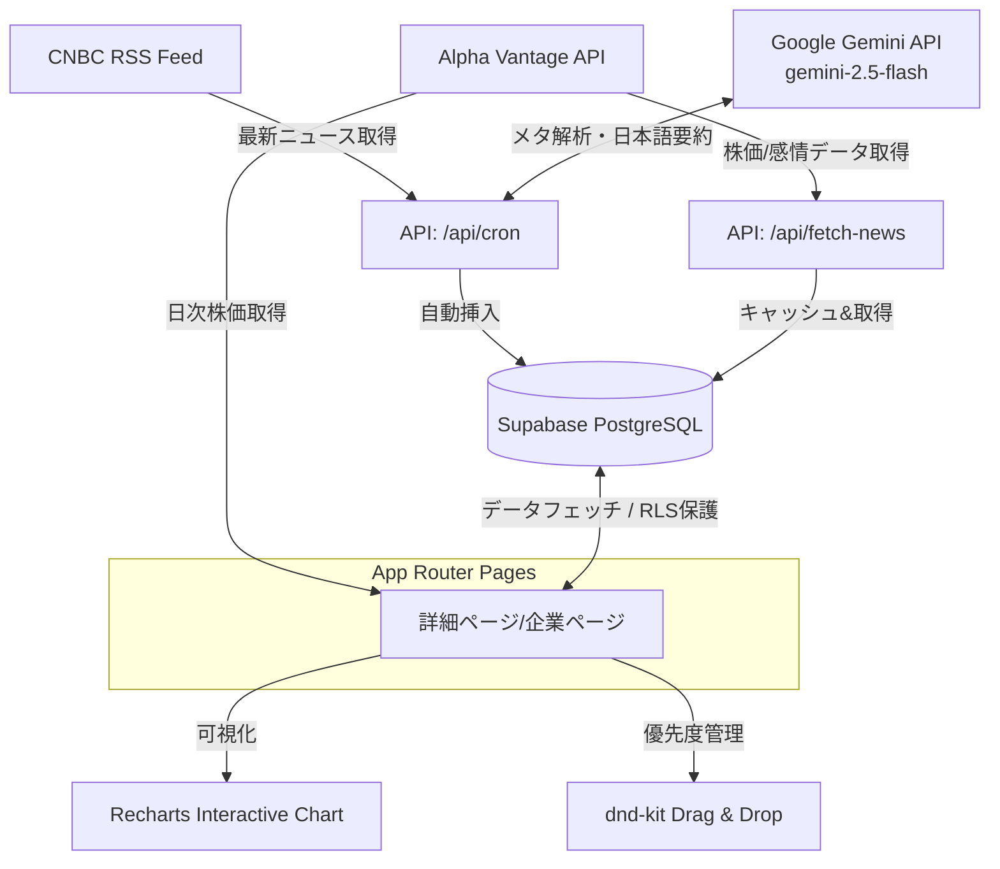

# NewsImpact 📈 | ニュース・株価相関分析＆優先度監視プラットフォーム

「このニュース、結局株価にどう影響したの？」を1秒でビジュアル分析。
米国のビジネスニュースと株価変動の相関関係を可視化し、注目銘柄のインテリジェントな優先度管理を実現するWebアプリケーションです。

---

## 💡 開発背景とコンセプト

投資家やビジネスパーソンにとって、「ニュースの発生」と「実際の市場の反応（株価）」を紐付けて理解することは極めて重要です。しかし、既存のツールでは、ニュースアプリと株価チャートツールを往復し、日付を照らし合わせて手動で確認する必要がありました。

**NewsImpact** は、この課題を解決するために開発されました。
- **情報の自動収集とAIによる要約・分類**: 毎日ニュースを収集し、LLMが要言や感情（センチメント）、対象ティッカーを自動判定。
- **視覚的な相関分析**: ニュース発生日を基準点として、その前後の株価推移をチャート上にオーバレイ表示。
- **直感的な監視リスト管理**: 気になった銘柄をドラッグ＆ドロップで優先度分類し、ウォッチを継続。

就職活動用のポートフォリオとして、**「ユーザー体験（UX）の快適さ」「API制限に耐えうる堅牢な設計」「最新のフロントエンド技術（React 19 / Next.js 16）」**に徹底的にこだわって設計・実装しました。

---

## 🏗 システムアーキテクチャ

本プロダクトは、Next.jsのApp Router構成を採用し、フロントエンドとバックエンドの境界をシームレスに繋いでいます。



---

## 🛠 技術スタック

| 技術分類 | 採用技術 | 選定理由・特徴 |
| :--- | :--- | :--- |
| **フロントエンド** | **React 19 / TypeScript** | 最新のReact機能と強力な型定義により、開発効率とコード品質を担保。 |
| **フレームワーク** | **Next.js 16 (App Router)** | SSR (Server-side Rendering) による高速なページ遷移と、API Routesを用いたバックエンド機能の統合。 |
| **デザイン/CSS** | **Tailwind CSS v4** | ユーティリティファーストでの高速なスタイリングと、クリーンで洗練されたモダンUIの実装。 |
| **データベース** | **Supabase (PostgreSQL)** | RLS (Row Level Security) によるセキュアなデータアクセス、高速な開発サイクル。 |
| **LLM統合** | **Gemini 2.5 Flash** | ニュースの日本語要約、言及企業（ティッカーシンボル）の自動検出、感情分析を極めて高速かつ高精度に処理。 |
| **グラフ・可視化** | **Recharts** | Reactフレンドリーでレスポンシブなチャートライブラリ。独自のインタラクティブUIを容易に統合可能。 |
| **Dnd (操作系)** | **@dnd-kit** | アクセシビリティに配慮され、高パフォーマンスなドラッグ＆ドロップ機能を提供。 |
| **外部API** | **Alpha Vantage** | リアルタイム・ヒストリカルな株価データおよび金融センチメントデータソース。 |

---

## ✨ 主要機能

### 1. ニュースダッシュボード (`app/page.tsx`)
* **3つのアクティブビュー**:
  * `最新ニュース`: 今日収集された最新ニュースを一覧表示。
  * `詳細検索`: 銘柄（ティッカー）、ジャンル（Tech, Financeなど）、日付期間指定での一括絞り込み。
  * `ブックマーク`: Supabaseと連携し、お気に入りのニュースを一覧でストック。
* **パフォーマンスキャッシュ**: 外部APIへの無駄なリクエストを抑えるため、1時間以内のリクエストに対してはSupabaseに保存されたキャッシュを優先返却。

### 2. 株価相関インパクトチャート (`app/news/[id]/page.tsx`)
* **時間的相関の可視化**: ニュースが公開された「基準日」をチャート上に縦線（ReferenceLine）としてプロット。その前後最大90日間の株価推移を俯瞰可能。
* **Brushスライダー制御**: 表示期間をユーザーが動的に調整可能。
* **複数イベントの同時プロット**: 同一銘柄に関する「他の関連ニュース」も、チャート上のデータポイントとしてマッピング。クリックで他ニュースの詳細に切り替えることが可能。

### 3. 優先度監視カンバンボード (`app/watchlist/page.tsx`)
* **4カラム管理**: 企業を `INBOX（未分類）`、`Low`、`Medium`、`High` に整理。
* **ドラッグ＆ドロップ**: ラグがなく、快適に動作するドラッグ操作。
* **即時反映（Optimistic UI）と裏同期**: ドラッグした瞬間に画面の配置を変更（UXを阻害しない）し、バックグラウンドでSupabaseのデータを自動更新。

### 4. 自動バックグラウンドタスク (`app/api/cron/route.ts`)
* **自律的なニュース解析**: CNBC TechニュースのRSSから自動で記事を取得し、Gemini APIを用いて以下の解析を実施。
  1. 言及されている企業の「ティッカーシンボル（AAPLなど）」と「正式企業名」の抽出。
  2. ニュース全体のセンチメント判定（`up` / `down` / `flat`）。
  3. 最大40文字の簡潔な「日本語要約」の自動生成。

---

## ⚡️ こだわった技術的アプローチ ＆ UX設計

### ① ラグなしドラッグ＆ドロップの実現（描画最適化）
ドラッグ＆ドロップの実装において、一般的な `transform: CSS.Transform.toString(transform)` を使うと、要素が再レンダリングされる際にCPU/GPU負荷が高まり、操作に遅延（引っかかり）が生じることがあります。
* **対策**: `CSS.Translate.toString(transform)` を使用し、GPUによるレンダリング処理（3Dアクセラレーション）を強制させることで、ラグを完全に解消しました。
* **モバイル干渉の防止**: タッチデバイスでのドラッグ時にスクロールが暴発しないよう、カード要素に対して `touchAction: 'none'` を指定し、スムーズなモバイル操作を実現しました。
* **誤イベントの排除**: カード内の個別リンクや削除ボタンを押したときにドラッグが始まらないよう、`onPointerDown={(e) => e.stopPropagation()}` を設定し、イベント伝播を厳密に制御しています。

### ② 金融市場特有のデータ欠損対策（土日埋めロジック）
株式市場は土曜日・日曜日にクローズするため、株価データ（時系列データ）が存在しません。しかし、ニュースは週末にも発表されます。
* **課題**: 週末に発表されたニュースを基準点に置くと、株価データと日付が完全一致せず、チャート上の「基準線」が表示されなくなったり、プロットがずれるバグが発生していました。
* **対策**: フロントエンドのデータ処理で、ニュースの日付がデータ終点（または週末）よりも新しい場合、最後に記録された金曜日の終値を補完データとして動的に挿入する「土日埋めアルゴリズム」を実装しました。これにより、チャートの整合性を常に100%維持しています。

### ③ API制限の完全克服（堅牢なフォールバック設計）
無料枠のAlpha Vantage APIはコール制限（1分あたり数回など）があり、複数のユーザーが同時にアクセスすると高確率でエラーを返します。
* **対策**: APIがエラー、またはレート制限に達したことを検知すると、アプリケーション全体をクラッシュさせるのではなく、**日付を本日分に自動マッピングした開発用モックデータ（ダミー）を返却するフォールバック機能**を構築しました。これにより、面接官がいつデモサイトを開いても、常に動的で完璧な動作を見せられる設計にしています。

### ④ ポップオーバーのUX配慮（ディレイ処理 ＆ 重複回避）
チャート上のデータポイントにマウスを乗せた際、詳細ポップオーバーを表示しますが、少しでもマウスがずれると消えてしまいクリックしにくいという課題がありました。
* **対策**: `pointer-events` を調整し、マウスアウト時に `250ms` の猶予時間を設ける（setTimeoutによるバッチ制御）ことで、ユーザーがマウスをポップオーバー内に安全に移動させられるようにしました。
* **重複配置計算**: 同じ日付に複数のニュースが重なった場合、マーカーが重なって見えなくなるのを防ぐため、同一日付のデータに対するY軸方向のオフセット配置アルゴリズムを導入しました。

---

## 📊 データベース設計（テーブル定義）

パフォーマンス向上のため、検索や並び替えで多用されるカラムに対して適切なインデックスを設定しています。

```sql
-- ニュースデータ保存用
CREATE TABLE news (
    id BIGINT GENERATED BY DEFAULT AS IDENTITY PRIMARY KEY,
    title TEXT NOT NULL,
    summary TEXT,
    url TEXT UNIQUE NOT NULL,
    published_at TEXT NOT NULL,
    source TEXT,
    image_url TEXT,
    genre TEXT,
    symbol TEXT,
    is_bookmarked BOOLEAN DEFAULT FALSE,
    created_at TIMESTAMP WITH TIME ZONE DEFAULT TIMEZONE('utc'::text, NOW()) NOT NULL
);

-- インデックス設定 (検索・ソートの高速化)
CREATE INDEX idx_news_published_at ON news (published_at DESC);
CREATE INDEX idx_news_symbol ON news (symbol);
CREATE INDEX idx_news_is_bookmarked ON news (is_bookmarked);

-- 監視リスト & 優先度保存用
CREATE TABLE watchlist (
    id BIGINT GENERATED BY DEFAULT AS IDENTITY PRIMARY KEY,
    symbol TEXT NOT NULL UNIQUE,
    company_name TEXT NOT NULL,
    attention_level TEXT CHECK (attention_level IN ('none', 'low', 'medium', 'high')) DEFAULT 'none',
    created_at TIMESTAMP WITH TIME ZONE DEFAULT TIMEZONE('utc'::text, NOW()) NOT NULL
);

CREATE INDEX idx_watchlist_symbol ON watchlist (symbol);
```

---

## ⚙️ セットアップ手順

### 1. 依存関係のインストール
```bash
npm install
```

### 2. 環境変数の設定 (`.env.local`)
プロジェクトのルートに `.env.local` ファイルを作成し、以下の変数を定義します。
```env
NEXT_PUBLIC_SUPABASE_URL=あなたのSupabaseプロジェクトURL
NEXT_PUBLIC_SUPABASE_ANON_KEY=あなたのSupabase Anon Key
GOOGLE_API_KEY=あなたのGemini(Google AI Studio)APIキー
ALPHA_VANTAGE_KEY=あなたのAlpha Vantage APIキー
```

### 3. Supabaseデータベースの準備
1. [Supabase Dashboard](https://supabase.com/dashboard) にログインし、プロジェクトを作成します。
2. 左メニューの **SQL Editor** を開きます。
3. `supabase_setup.sql` の内容をエディタに貼り付け、**Run** を実行します。

### 4. 起動
```bash
npm run dev
```
ブラウザで [http://localhost:3000](http://localhost:3000) を開き、アプリが動作することを確認します。

---

## 🔮 今後の展望 / 実装予定の機能
- **ユーザー認証 (Supabase Auth)**: 個々のユーザーが自分専用のブックマークや監視リストを持てるようにマルチテナント化。
- **プッシュ通知機能**: 監視リストに登録している企業の株価がニュース前後で急変した（閾値を超えた）場合、ブラウザ通知またはSlackへアラート送信する機能。
- **Geminiによる相関の定性分析**: 数値的な株価の増減だけでなく、AIが「なぜこのニュースがこの株価変動を引き起こしたのか」の要因仮説を自動生成して表示する機能。
